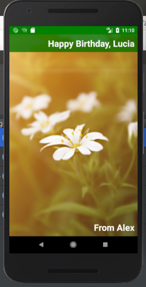

```txt

Udacity - Android Basics: User Interface

Project Birthday Card

minSdkVersion=16
compileSdkVersion=28

What I am learn:
    - Image are problem, prefer to use xml/svg
    - If you don't put image for every density pixel x*dpi
        use app:srcCompat="@drawable/sunshine" (even this is a small image as possible)
        instead android:src="*"

        to use app:srcCompat add to build.grande (app) android.defaultConfig
        vectorDrawables.useSupportLibrary true
```

